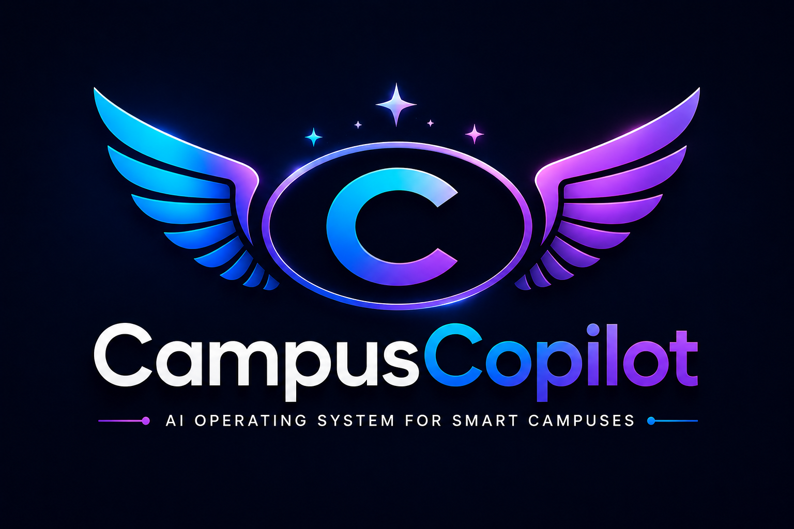
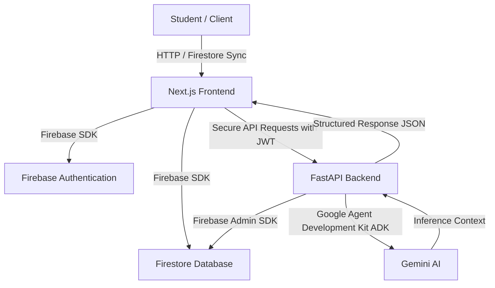
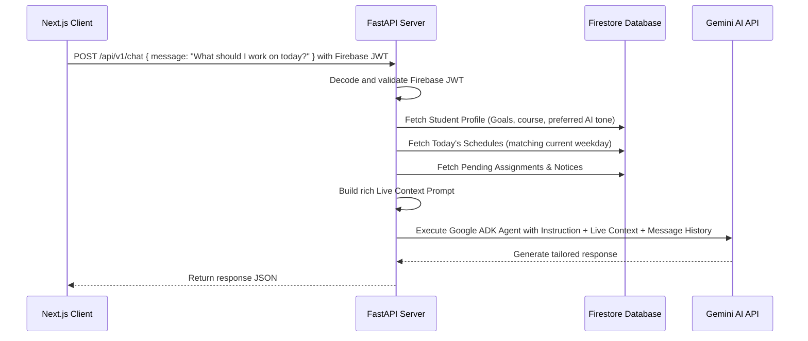
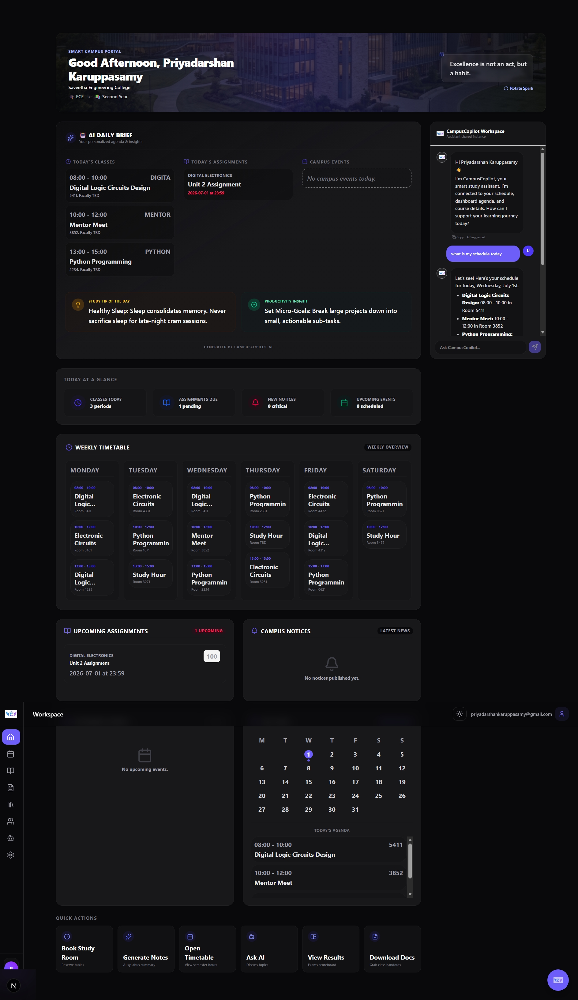
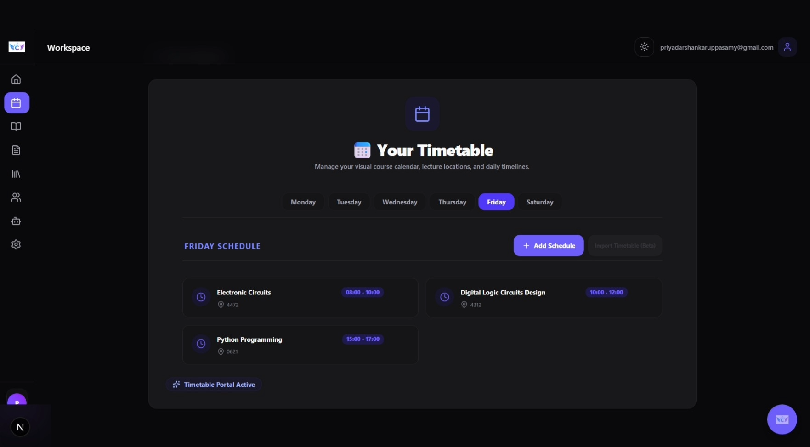
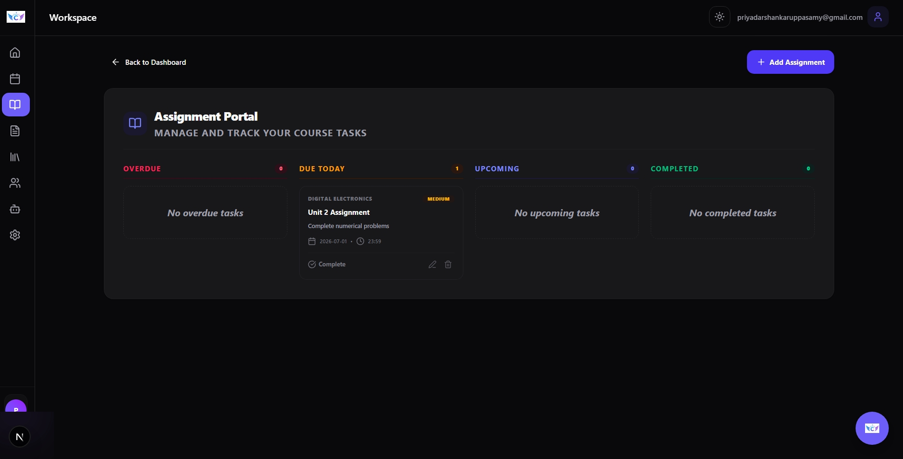
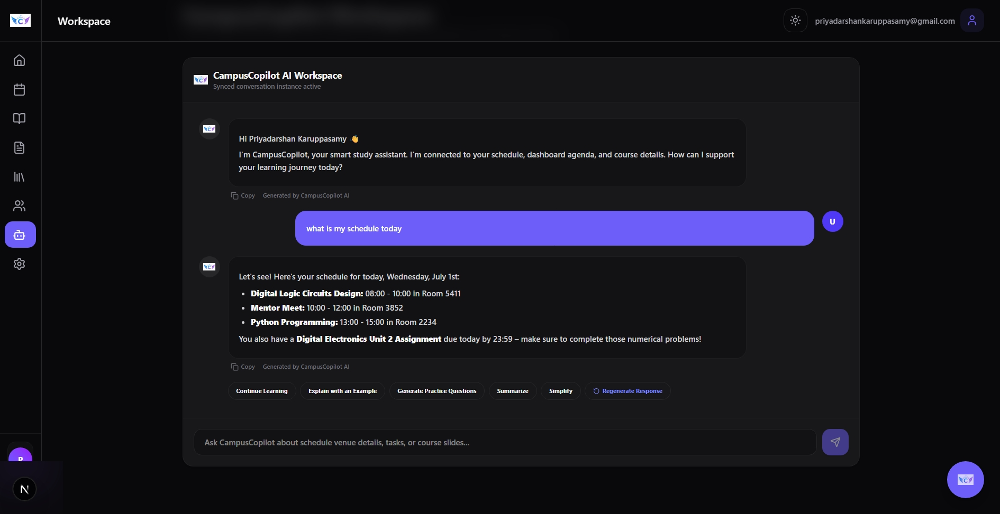

# <p align="center">  </p>

<p align="center">
  <strong>AI Operating System for Smart Campuses</strong>
</p>

<p align="center">
  <a href="https://nextjs.org/">
    
  </a>
  <a href="https://fastapi.tiangolo.com/">
    
  </a>
  <a href="https://firebase.google.com/">
    
  </a>
  <a href="https://deepmind.google/technologies/gemini/">
    
  </a>
  <a href="https://opensource.org/licenses/MIT">
    
  </a>
</p>

---

## 📖 Project Overview

**CampusCopilot** is a premium, open-source AI-powered academic operating system designed to centralize and simplify student life. Instead of switching between disconnected apps for schedules, assignments, study resources, and AI search engines, CampusCopilot integrates all student activities into a single collaborative workspace. Powered by the Google Agent Development Kit (ADK) and Gemini AI, the system acts as an intelligent mentor, dynamically resolving context (such as active schedules, due assignments, and academic goals) to provide encouragement, tailored study planning, and contextual answers.

---

## ✨ Features

| Feature | Description | Value Proposition |
| :--- | :--- | :--- |
| **🤖 AI Assistant** | A conversational academic mentor that maintains historical context and references active schedules/assignments. | Custom-tailored advice based on student year, course, and goals. |
| **📅 Smart Weekly Timetable** | Grid-based representation of weekly lectures grouped from Monday to Saturday with real-time Firestore sync. | Eliminates duplicate entries and displays room numbers and faculty details. |
| **📝 Assignment Management** | Modern card deck columns categorizing assignments by *Overdue*, *Today*, *Upcoming*, and *Completed*. | Enables instant CRUD operations and status updates with real-time UI refreshes. |
| **✨ Daily AI Brief** | A personalized dashboard greeting card summarizing the student's active schedule and due dates. | Keeps student focused on immediate requirements upon signing in. |
| **🔒 Firebase Authentication** | High-security login flow with state persistence settings and secure route guards. | Validates sessions and maps client UIDs with backend records securely. |
| **🔍 University Search** | Autocomplete campus selector helping students link their institution during onboarding. | Automatically builds academic metadata context. |
| **🔄 Real-time Database Sync** | Full integration with Firestore listening for updates on timetables, notices, and events. | Keeps UI elements updated immediately without requiring manual browser reloads. |
| **📊 Personalized Dashboard** | Unified panel integrating weekly timetables, upcoming assignments, and active notices. | Provides a clean, aesthetic starting point for daily routines. |

---

## 🛠️ Technology Stack

* **Frontend:** Next.js 15, React 19, TypeScript, Tailwind CSS, Framer Motion, Lucide Icons.
* **Backend:** FastAPI (Python 3.10+), Google Agent Development Kit (ADK), Firebase Admin SDK.
* **Database & Auth:** Firebase Firestore Database (Real-time collections), Firebase Auth (OAuth2 JWT validation).
* **AI Engine:** Google Gemini (Gemini 2.5 Flash API).

---

## 🏗️ Architecture



---

## 📁 Project Structure

```text
CampusCopilot/
├── backend/               # FastAPI Python Server
│   ├── app/
│   │   ├── api/           # Auth sync & chat endpoint routers
│   │   ├── core/          # App settings & Firebase credentials configuration
│   │   └── services/      # Firestore connector & Gemini Agent Manager
│   ├── Dockerfile         # Backend container definition
│   ├── requirements.txt   # Backend Python packages
│   └── verify_api.py      # Integration check verification script
├── frontend/              # Next.js 15 Client Web Application
│   ├── public/            # Static assets & brand asset logos
│   └── src/
│       ├── app/           # Client routes, pages & layout workspaces
│       ├── components/    # Reusable UI cards & Floating AI drawer components
│       ├── context/       # Auth & AI Chat providers
│       ├── hooks/         # UI hooks (toast, etc.)
│       └── services/      # Dashboard Firestore fetches
├── screenshots/           # Application screenshots directory
└── README.md              # Project documentation
```

---

## 🚀 Installation & Setup

Follow these steps to run a local development environment.

### 1. Environment Configurations

#### Backend Environment Variables
Create a file named `.env` in the `backend/` directory:
```env
# Server settings
PORT=8000

# Google Gemini API
GEMINI_API_KEY=your_gemini_api_key_here

# Firebase Configuration
FIREBASE_PROJECT_ID=your_firebase_project_id_here
# Raw JSON string of your Firebase Service Account Private Key
FIREBASE_PRIVATE_KEY_JSON={"type": "service_account", ...}
```

#### Frontend Environment Variables
Create a file named `.env.local` in the `frontend/` directory:
```env
NEXT_PUBLIC_FIREBASE_API_KEY=your_client_firebase_api_key
NEXT_PUBLIC_FIREBASE_AUTH_DOMAIN=your_project.firebaseapp.com
NEXT_PUBLIC_FIREBASE_PROJECT_ID=your_project_id
NEXT_PUBLIC_FIREBASE_STORAGE_BUCKET=your_project.appspot.com
NEXT_PUBLIC_FIREBASE_MESSAGING_SENDER_ID=your_sender_id
NEXT_PUBLIC_FIREBASE_APP_ID=your_app_id
```

### 2. Backend Setup
```bash
# Navigate to backend directory
cd backend

# Create and activate python virtual environment
python -m venv .venv
# On Windows PowerShell:
.venv\Scripts\Activate.ps1
# On Linux/macOS:
source .venv/bin/activate

# Install dependencies
pip install -r requirements.txt

# Start local backend server
uvicorn app.main:app --host 0.0.0.0 --port 8000 --reload
```

### 3. Frontend Setup
```bash
# Navigate to frontend directory
cd frontend

# Install node dependencies
npm install

# Start local web development server
npm run dev
```
Open [http://localhost:3000](http://localhost:3000) in your web browser.

---

## 🤖 AI Workflow & Context Gathering

CampusCopilot gathers rich dynamic context about the logged-in student before consulting Gemini. This ensures the AI model acts as a genuine academic mentor, preventing generic boilerplate AI responses:



---

## 📸 Screenshots

| Home Dashboard | Weekly Timetable |
| --- | --- |
|  |  |

| Assignments | AI Workspace | Settings |
| --- | --- | --- |
|  |  |  |

---

## 🔮 Roadmap

### Completed Features (Sprint 14)
* **[x] Authentication:** Full multi-role login with Remember Me credentials persistence.
* **[x] Dashboard UI:** Compact weekly timetable columns and upcoming task cards.
* **[x] AI Assistant:** Sidebar context query pipelines and floating assistant widget.
* **[x] Timetable:** Weekly schedule grouping and system weekday schedule filtering.
* **[x] Assignment Manager:** Dynamic Kanban columns, edit modals, and completion toggles.
* **[x] Branding:** Official icon and logo integrations.
* **[x] GitHub Integration:** Structuring codebase layout and documentation.

### Upcoming Milestones
* **[ ] Attendance Tracker:** Scan and log attendance logs with automatic alert warnings for critical status levels.
* **[ ] Parent Portal:** Read-only access keys for guardians to monitor due dates and class attendance.
* **[ ] Faculty Dashboard:** Course management panels for professors to publish schedules, assignments, and critical notices.
* **[ ] OCR Notes Scanner:** Upload image snapshots of whiteboard lectures and summarize them into markdown notes using Gemini Multimodal APIs.
* **[ ] Placement Assistant:** CV resume reviews and mock technical ECE interview pipelines powered by Gemini.

---

## 👨‍💻 Developer Profile

* **Developer:** P. Priyadarshan Karuppasamy
* **Department:** Electronics and Communication Engineering
* **Institution:** Saveetha Engineering College
* **Hackathon Submission:** Created for the Kaggle AI Agents Hackathon.

---

## 📄 License

This project is licensed under the MIT License - see the [LICENSE](LICENSE) file for details.