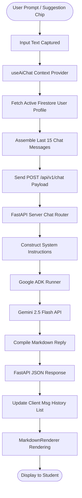
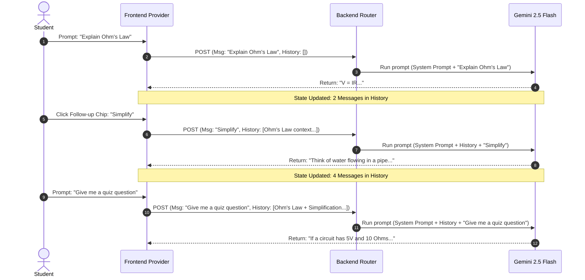

# 🤖 CampusCopilot AI Workflow Documentation

This document outlines the AI orchestration lifecycle, prompt personalization patterns, conversation memory management, and rendering pipelines within CampusCopilot.

---

## 🔄 End-to-End AI Workflow Diagram

The flow below represents the complete processing loop from the moment a user submits a query or clicks a suggested prompt chip until the formatted markdown is output to the interface:



---

## 🧩 Step-by-Step Processing Flow

1. **Submission**: The user enters a question in the prompt input field or clicks a Suggested Question chip (e.g. *Explain a concept*).
2. **Context Compilation**: The frontend `useAiChat` provider intercepts the submission and extracts:
   - The user profile variables cached in active Firestore memory.
   - The message log containing up to the last 15 messages (10–20 limit bounds).
3. **Payload Dispatch**: The client dispatches a POST request to the backend `/chat` router with a serialized JSON body:
   ```json
   {
     "message": "Explain Ohm's Law",
     "profile": {
       "fullName": "Priyadarshan Karuppasamy",
       "role": "Student",
       "institutionName": "Saveetha Engineering College",
       "course": "ECE",
       "yearOfStudy": "Second Year",
       "academicGoals": ["Understand Analog Electronics"],
       "aiTone": "balanced"
     },
     "history": [
       {"role": "user", "text": "..."},
       {"role": "assistant", "text": "..."}
     ]
   }
   ```
4. **Prompt Assembly**: The FastAPI server receives the schema, constructs a system prompt defining constraints, and appends the conversation history formatted as a speech feed (`User: ... \n Assistant: ...`).
5. **Agent Inference**: The compiled prompt is sent through the Google ADK interface to the Gemini 2.5 Flash model API.
6. **Persona Filtering**: Gemini processes the request, applies the academic mentor personality guidelines, formats calculations and explanations using markdown, and streams the output text.
7. **Client Rendering**: The compiled payload is sent back to the frontend client, updating the active conversation history log, and rendering HTML blocks using `MarkdownRenderer`.

---

## 🎓 Personalization Rules

CampusCopilot personalizes Gemini responses using user profiles. The system follows strict guidelines to keep interactions natural and prevent robotic repetition:

* **Internal Context Mapping**: User profiles are passed into system prompt instructions to adapt examples. For instance, an ECE student will receive circuits-based analogies for engineering concepts.
* **Recitation Limits**: The model is instructed to avoid repeating the student's name, role, major, or institution verbatim (e.g. avoiding preambles like *"Hello Priyadarshan, as a Second Year ECE student at Saveetha..."*) unless they directly improve the educational context of the explanation.
* **Tone Accommodation**:
  - `concise` ➔ Very short, direct, and straight-to-the-point answers.
  - `detailed` / `comprehensive` ➔ In-depth structured breakdowns and detailed explanations.
  - `mentoring` / `balanced` ➔ Medium-length encouraging guidance.

---

## 🧠 Conversation Memory & Context Preservation

To allow multi-turn logical progression, CampusCopilot maintains history structures. Below is a sample context preservation lifecycle mapping:



By passing previous message records in the payload, the backend can prepends context before the newest user query. This allows follow-up chips like "Simplify", "Explain with an Example", or "Continue Learning" to resolve correctly without the user having to retype the topic.

---

## 🎨 Response Rendering & Interactions

All bot replies are parsed dynamically inside the [MarkdownRenderer](file:///c:/Users/acer/Downloads/CampusCopilot/frontend/src/app/home/MarkdownRenderer.tsx) element:

* **Syntax Highlighting**: Code blocks are wrapped in card structures with styling and copy tags.
* **Table Generation**: Formatted table layouts are mapped to responsive, division-lined grid cards.
* **Unordered / Ordered Lists**: List items are rendered using customized bullet offsets.
* **Actions**:
  - **Copy Button**: Copies the response to the clipboard and triggers a toast notification.
  - **Regenerate Button**: Resubmits the previous user prompt to query the backend again.

---

## 🛠️ Error Handling & Fallbacks

CampusCopilot handles system failures gracefully to ensure a robust user experience:

* **Backend Router Failures**: If the FastAPI server throws an error (e.g. database access issues), the backend returns a clean JSON exception code (`HTTP 500`). The frontend displays a descriptive toast warning without breaking active state components.
* **Gemini API Outages**: If Google ADK fails to communicate with Gemini (or exceeds quota limits), the router falls back to a descriptive error message: *"CampusCopilot AI service is currently unavailable. Please try again shortly."*
* **Network & Connection Failures**: If the client is offline or cannot fetch endpoints, the provider marks `aiLoading` as `false` and prompts: *"Network connection issues detected. Please check your internet connection."*

---

## 🔒 Security Operations

* **State Isolation**: Conversation memory and user profile fetching happen on authenticated client sessions. The API endpoint validates requests using active Firebase tokens.
* **No Profile Fabrication**: System prompt instructions explicitly restrict Gemini from assuming or inventing profile attributes not verified in the payload (marked as `not provided`).
* **Server-Side Construction**: Prompts are assembled server-side inside FastAPI to prevent tampering or client injection attacks.
