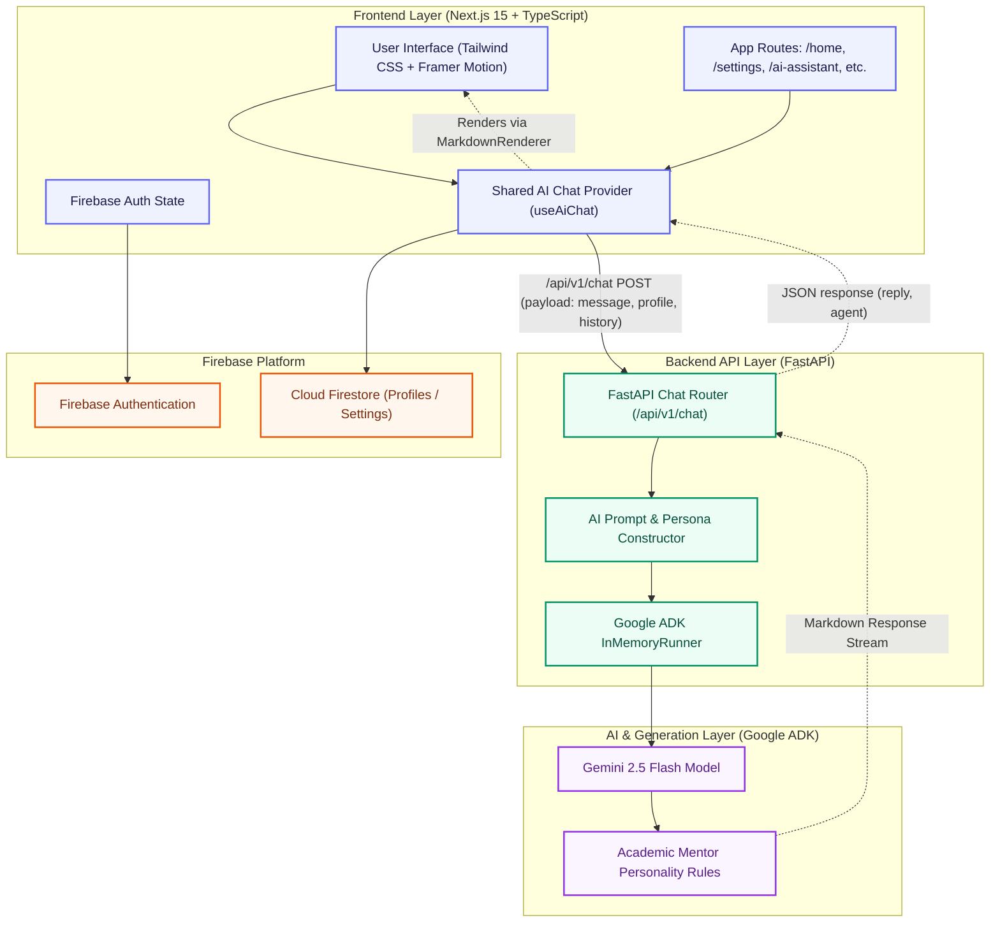
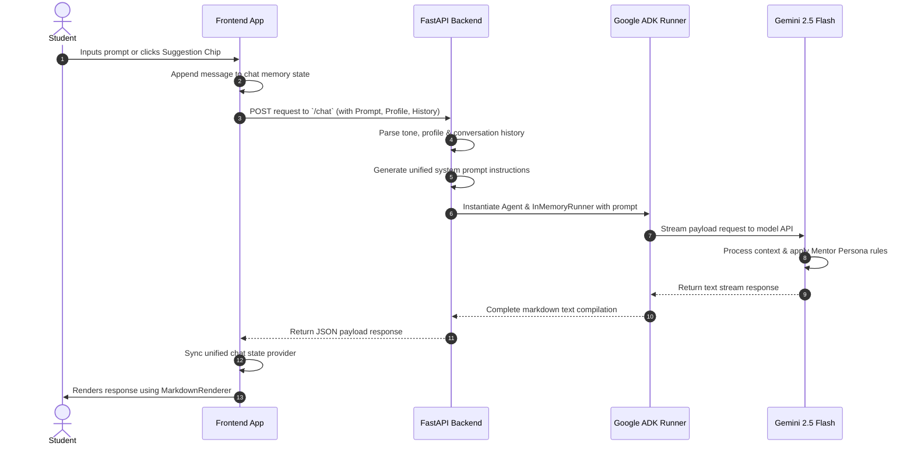

# 🏗️ CampusCopilot Architecture & Design System

This document outlines the system architecture, component design, and data lifecycle flow for CampusCopilot.

---

## 📊 System Architecture Diagram

Below is the complete system diagram representing the relationship between the Frontend application, Firebase services, FastAPI backend, and the Google ADK AI layer.

---

## 🧩 Component Breakdown

### 1. Frontend Layer
* **Next.js 15 & TypeScript**: Core application architecture offering type safety, optimized file-based routing, and responsive client layouts.
* **Tailwind CSS & Framer Motion**: Provides curated visual aesthetics, smooth layout animations, support for light/dark themes, and responsive design systems.
* **Shared AI Chat Provider (`useAiChat`)**: Manages the application's conversation memory, active loading states, copy tasks, detail widgets toggles, and UI-wide chat feed synchronization.
* **Component Views**:
  - **Dashboard**: Consolidates study agendas, Quick Action cards, and the AI Daily Brief.
  - **AI Workspace**: Embedded workspace panel that syncs with the floating widget.
  - **Settings**: Dynamic cards for profile maintenance, academic milestones, and AI tones.

### 2. Firebase Services Platform
* **Firebase Authentication**: Handles secure user registration, email validation, onboarding, and auth tracking.
* **Cloud Firestore**: Holds data models for User Profiles, course preferences, and sync parameters.

### 3. Backend API Layer
* **FastAPI**: High-performance, asynchronous Python web framework hosting modular REST endpoints.
* **AI Prompt Construction**: Programmatically creates system instruction strings combining tone parameters, persona requirements, and student demographics.
* **Conversation Memory**: Prepares history payloads to maintain context across messages.
* **Profile Personalization**: Adapts system prompt instructions to include profile details implicitly.

### 4. AI & Generation Layer
* **Google ADK**: Agent Development Kit orchestrating agent creation and runtime loops.
* **Gemini 2.5 Flash**: Decides actions, processes context-heavy user prompts, and generates accurate output.
* **Academic Mentor Persona**: Tone rules ensuring responses sound natural, friendly, and structured.
* **Markdown Responses**: Native generation formatting for tables, headers, blockquotes, code syntax, and bullet lists.

---

## 🔄 Request Lifecycle (Data Flow)

The timeline below details how data flows when a student prompts the assistant:

1. **User Action**: The student inputs a message or clicks a suggested prompt chip.
2. **State Appended**: The prompt is appended to the unified frontend chat memory.
3. **API Dispatch**: The frontend dispatches a POST request to the backend `/chat` endpoint.
4. **Context Injection**: The backend retrieves the request data, formats the profile context, and parses conversation memory.
5. **Prompt Setup**: The backend constructs a system instruction containing the personalization variables and mentor persona rules.
6. **Agent Launch**: The backend starts a Google ADK InMemoryRunner with the instruction set.
7. **Gemini Execution**: The ADK runner queries Gemini 2.5 Flash.
8. **Generation**: Gemini generates a structured response using Markdown notation.
9. **Return**: The FastAPI server returns the finalized response to the frontend client.
10. **Render**: The frontend updates the shared context state and renders the markdown cleanly using the `MarkdownRenderer`.
