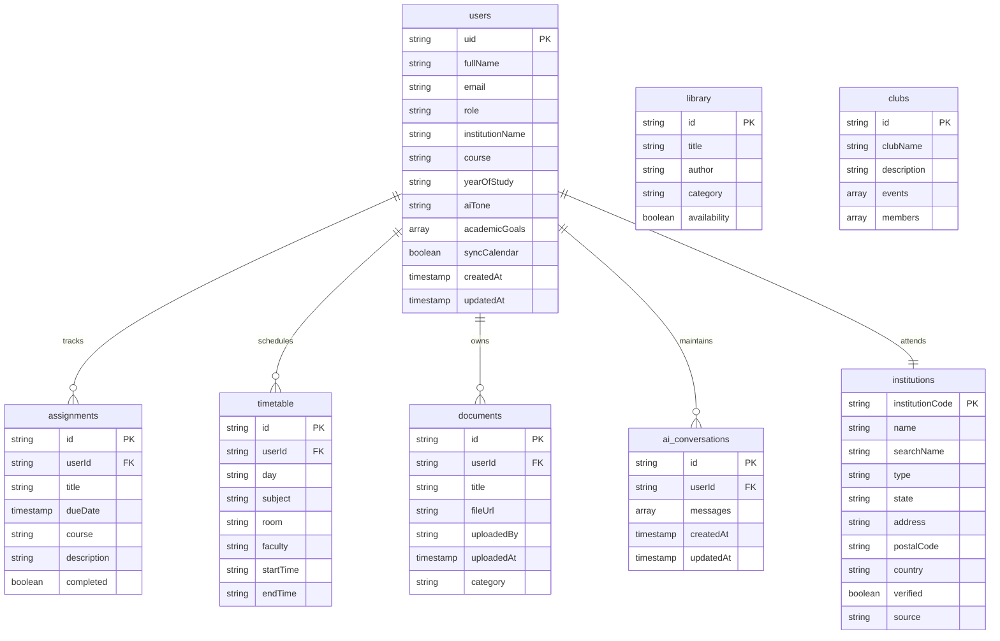

# 🗄️ CampusCopilot Database Documentation

This document outlines the Firestore NoSQL database architecture, entity relationships, security principles, and scalability patterns for CampusCopilot.

---

## 🌟 Why Firebase Firestore?

CampusCopilot leverages **Google Cloud Firestore** as its primary operational database. The choice is driven by the following enterprise-grade characteristics:

1. **Real-Time Synchronization**: Instantly synchronization of profile changes, schedules, and active conversation state updates between the client interfaces and Firestore without manual pooling.
2. **Flexible Document Model**: Adapts seamlessly to changing student profiles and onboarding metadata models without requiring complex schema migrations.
3. **Firebase Authentication Integration**: Out-of-the-box support for user identity verification, allowing direct mapping of Firebase credentials to collection structures.
4. **Serverless Architecture**: Eliminates traditional database provisioning, load balancing, and tuning, reducing operational overhead.
5. **Easy Expansion**: Simplifies adding future academic and collaboration features (e.g. assignments, documents, or library logs) as independent sub-collections or root-level associations.

---

## 📊 Current Database Collections (Active)

CampusCopilot currently manages the following collections:

### 1. `users`
* **Purpose**: Stores authenticated user profiles and custom onboarding AI preferences.
* **Key Fields**:
  - `uid` (String, PK): Matches the corresponding Firebase Authentication user unique identifier.
  - `fullName` (String): The student or faculty user's full name.
  - `email` (String): Contact email address.
  - `role` (String): Role of user within the platform (e.g. `Student`, `Faculty`, `Admin`).
  - `institutionName` (String): Verified institution name attended by the user.
  - `course` (String): Academic course or major program of study.
  - `yearOfStudy` (String): Academic milestone (e.g. `First Year`, `Second Year`, `Alumni`).
  - `academicGoals` (Array of Strings): Personal objectives defined by the student.
  - `aiTone` (String): Custom Response style choice (e.g. `concise`, `balanced`, `detailed`).
  - `syncCalendar` (Boolean): Consent flag to map dashboard schedule tasks to Google Calendar.
  - `createdAt` (Timestamp): Record creation date.
  - `updatedAt` (Timestamp): Record modification date.
* **Relationships**: Integrates directly with the `institutions` collection on search results.

---

### 2. `institutions`
* **Purpose**: Houses verified educational institutions and college profiles.
* **Key Fields**:
  - `institutionCode` (String, PK): Standardized code prefix.
  - `name` (String): Official academic name.
  - `searchName` (String): Lowercase index for search queries.
  - `type` (String): Classification (e.g. `Central University`, `Private College`).
  - `state` (String): Geographic state region.
  - `address` (String): Full physical campus address.
  - `postalCode` (String): Postal area code.
  - `country` (String): Academic jurisdiction country.
  - `verified` (Boolean): Flag representing verification approval status.
  - `source` (String): Origin metadata file index.
* **Relationships**: Linked to `users` on enrollment profiles.

---

## 🔮 Future Database Collections (Version 2 - Planned Roadmap)

The next developmental milestone will introduce the following records and structures:

### 1. `assignments` (Planned)
* **Purpose**: Track course checkpoints, submission tasks, and due dates.
* **Key Fields**: `id`, `userId` (FK), `title`, `dueDate`, `course`, `description`, `completed`.

### 2. `timetable` (Planned)
* **Purpose**: Stores the student's daily timetable events, venue details, and class durations.
* **Key Fields**: `id`, `userId` (FK), `day` (e.g. `Monday`), `subject`, `room`, `faculty`, `startTime`, `endTime`.

### 3. `documents` (Planned)
* **Purpose**: Manages uploaded lecture materials, PDFs, notes, and file access locations.
* **Key Fields**: `id`, `userId` (FK), `title`, `fileUrl`, `uploadedBy`, `uploadedAt`, `category`.

### 4. `library` (Planned)
* **Purpose**: Indexes digital books, publications, and study references.
* **Key Fields**: `id`, `title`, `author`, `category`, `availability` (Boolean).

### 5. `clubs` (Planned)
* **Purpose**: Tracks student groups, active memberships, and campus notices.
* **Key Fields**: `id`, `clubName`, `description`, `events` (Array), `members` (Array).

### 6. `ai_conversations` (Planned)
* **Purpose**: Persistent storage for assistant memory beyond single-session provider states.
* **Key Fields**: `id`, `userId` (FK), `messages` (Array), `createdAt`, `updatedAt`.

---

## 📐 Entity Relationship (ER) Diagram

---

## 🔒 Security Operations

Firestore security operations are governed by a multi-tiered security pattern:

1. **Authentication Boundary**: Firebase Authentication manages user login validation. Unauthenticated clients are blocked from executing queries.
2. **Firestore Security Rules**: Rules enforce document-level validation to prevent cross-account reads and writes:
   - Users are restricted to document mutations matching their UID: `request.auth.uid == userId`.
   - Read permissions for the verified `institutions` collection are global for authenticated accounts, but write operations are restricted to `Admin` users.
3. **Backend API Validation**: The FastAPI backend performs structural and semantic checks using Pydantic models (e.g. `UserProfileSchema`) before communicating profile changes to Firestore.

---

## 📈 Scalability

Firestore supports seamless scalability to accommodate global campus footprints:

* **Multi-Institution Support**: The `institutions` database handles arbitrary campus lists, sorting and searching profiles using standard index operations.
* **Global Footprint Deployment**: Firestore automatically distributes replica datasets globally, ensuring low latency.
* **Scalable AI Personalization**: As prompt lengths or contexts scale, Firestore leverages optimized indexes to support fast, constant-time document fetches.
