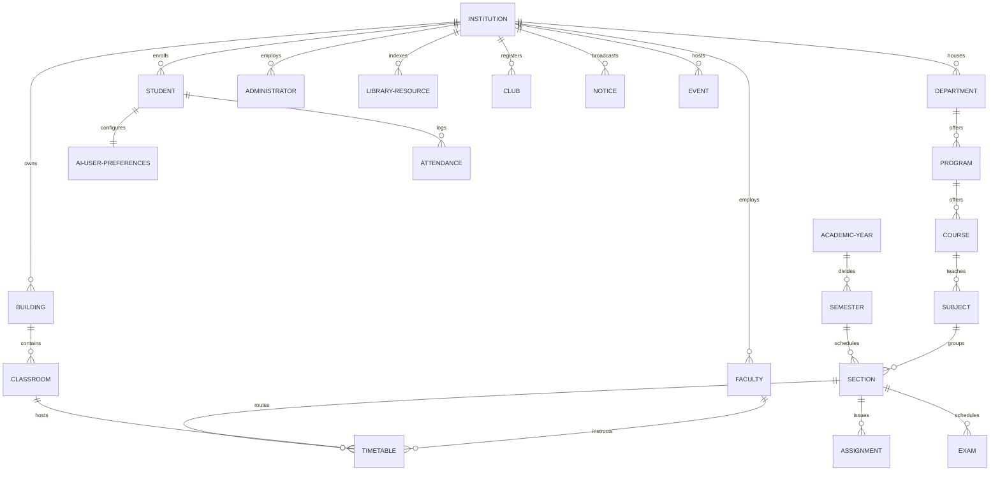

# CampusCopilot Relational Database Schema Blueprint

This document defines the official relational database schema design for the **CampusCopilot** platform. It provides a scalable, multi-tenant architecture designed to support multiple institutions, multi-campus divisions, and future academic workflow expansions.

---

## 1. Entity Relationship Overview

The schema uses a multi-tenant hierarchy where **Institution** is the root tenant. All academic scopes (Departments, Buildings, Programs, Users, Events) partition under a specific `institution_id` foreign key.



---

## 2. Relational Entity Specifications

---

### 1. Institution
*   **Purpose**: Represents the core root tenant (University/College) in the multi-tenant system.
*   **Fields**:
    *   `id` (UUID, Primary Key, Default: gen_random_uuid())
    *   `name` (VARCHAR(150), Not Null)
    *   `domain` (VARCHAR(50), Unique, Not Null) - e.g., `mit.edu`
    *   `location` (VARCHAR(200), Not Null)
    *   `created_at` (TIMESTAMP WITH TIME ZONE, Default: NOW())
*   **Relationships**: Has many Departments, Buildings, Students, Faculty, Administrators, Clubs, Library Resources.
*   **Example Data**:
    ```json
    {
      "id": "e30cf2f9-4672-466d-a190-7bf7d00f8653",
      "name": "Massachusetts Institute of Technology",
      "domain": "mit.edu",
      "location": "Cambridge, MA",
      "created_at": "2026-06-28T14:00:00Z"
    }
    ```

---

### 2. Department
*   **Purpose**: Academic divisions inside an institution hosting programs, faculty, and courses.
*   **Fields**:
    *   `id` (UUID, Primary Key)
    *   `institution_id` (UUID, Foreign Key referencing Institution.id, Indexed, Not Null)
    *   `name` (VARCHAR(100), Not Null)
    *   `code` (VARCHAR(10), Not Null) - e.g., `EECS`
*   **Relationships**: Belongs to Institution. Has many Programs, Faculty members.
*   **Example Data**:
    ```json
    {
      "id": "4b684cb6-5c5f-410a-8bf3-5be880fdf83f",
      "institution_id": "e30cf2f9-4672-466d-a190-7bf7d00f8653",
      "name": "Electrical Engineering & Computer Science",
      "code": "EECS"
    }
    ```

---

### 3. Program
*   **Purpose**: A degree program offered by a department (e.g., B.S. in Computer Science).
*   **Fields**:
    *   `id` (UUID, Primary Key)
    *   `department_id` (UUID, Foreign Key referencing Department.id, Indexed, Not Null)
    *   `name` (VARCHAR(100), Not Null)
    *   `degree_type` (VARCHAR(20), Not Null) - e.g., `BS`, `MS`, `PhD`
    *   `duration_semesters` (INTEGER, Not Null)
*   **Relationships**: Belongs to Department. Has many Courses, Students.
*   **Example Data**:
    ```json
    {
      "id": "ceab38f4-6d9b-4390-8451-b0e6e73f4e24",
      "department_id": "4b684cb6-5c5f-410a-8bf3-5be880fdf83f",
      "name": "Computer Science & Engineering",
      "degree_type": "BS",
      "duration_semesters": 8
    }
    ```

---

### 4. Course
*   **Purpose**: An official course unit catalog offered under an academic program.
*   **Fields**:
    *   `id` (UUID, Primary Key)
    *   `program_id` (UUID, Foreign Key referencing Program.id, Indexed, Not Null)
    *   `name` (VARCHAR(150), Not Null)
    *   `code` (VARCHAR(20), Unique under program, Not Null) - e.g., `CS-101`
    *   `credits` (NUMERIC(3,1), Not Null)
*   **Relationships**: Belongs to Program. Has many Subjects.
*   **Example Data**:
    ```json
    {
      "id": "8b783f98-963d-4951-b8ef-46c59b6c00d4",
      "program_id": "ceab38f4-6d9b-4390-8451-b0e6e73f4e24",
      "name": "Introduction to Computer Science",
      "code": "CS-101",
      "credits": 4.0
    }
    ```

---

### 5. Subject
*   **Purpose**: Specific module syllabus or lecture topic taught in a course.
*   **Fields**:
    *   `id` (UUID, Primary Key)
    *   `course_id` (UUID, Foreign Key referencing Course.id, Indexed, Not Null)
    *   `name` (VARCHAR(150), Not Null)
    *   `description` (TEXT)
*   **Relationships**: Belongs to Course. Has many Sections.
*   **Example Data**:
    ```json
    {
      "id": "78ffbc34-a78b-498c-9cbe-1234a5d89fbc",
      "course_id": "8b783f98-963d-4951-b8ef-46c59b6c00d4",
      "name": "Functional Programming Principles",
      "description": "Introduction to lambda calculus, map/filter transforms, recursion in Scheme."
    }
    ```

---

### 6. Student
*   **Purpose**: Stores student profiles, tracking enrollment identifiers.
*   **Fields**:
    *   `id` (UUID, Primary Key)
    *   `institution_id` (UUID, Foreign Key referencing Institution.id, Indexed, Not Null)
    *   `program_id` (UUID, Foreign Key referencing Program.id, Indexed, Not Null)
    *   `firebase_uid` (VARCHAR(128), Unique, Indexed, Not Null)
    *   `student_card_id` (VARCHAR(50), Unique, Not Null)
    *   `email` (VARCHAR(100), Unique, Not Null)
    *   `name` (VARCHAR(100), Not Null)
    *   `current_semester` (INTEGER, Not Null)
*   **Relationships**: Belongs to Institution, Program. Has one AI User Preference. Enrolled in many Sections (via enrollment table).
*   **Example Data**:
    ```json
    {
      "id": "dcf3bc89-13ad-48b9-bcde-5678a9cde012",
      "institution_id": "e30cf2f9-4672-466d-a190-7bf7d00f8653",
      "program_id": "ceab38f4-6d9b-4390-8451-b0e6e73f4e24",
      "firebase_uid": "usr_auth_firebase_student_908",
      "student_card_id": "2026-MIT-CS-9018",
      "email": "student@mit.edu",
      "name": "Alex Mercer",
      "current_semester": 1
    }
    ```

---

### 7. Faculty
*   **Purpose**: Stores profiles of professors and lecturers teaching subjects.
*   **Fields**:
    *   `id` (UUID, Primary Key)
    *   `institution_id` (UUID, Foreign Key referencing Institution.id, Indexed, Not Null)
    *   `department_id` (UUID, Foreign Key referencing Department.id, Indexed, Not Null)
    *   `firebase_uid` (VARCHAR(128), Unique, Indexed, Not Null)
    *   `email` (VARCHAR(100), Unique, Not Null)
    *   `name` (VARCHAR(100), Not Null)
    *   `academic_title` (VARCHAR(100), Not Null) - e.g., `Associate Professor`
*   **Relationships**: Belongs to Institution, Department. Instructs many Timetable periods.
*   **Example Data**:
    ```json
    {
      "id": "fa89bcde-3456-4789-abcd-123456789abc",
      "institution_id": "e30cf2f9-4672-466d-a190-7bf7d00f8653",
      "department_id": "4b684cb6-5c5f-410a-8bf3-5be880fdf83f",
      "firebase_uid": "usr_auth_firebase_prof_21",
      "email": "professor@mit.edu",
      "name": "Barbara Liskov",
      "academic_title": "Professor of Computer Science"
    }
    ```

---

### 8. Administrator
*   **Purpose**: Administrative accounts managing databases, structures, departments.
*   **Fields**:
    *   `id` (UUID, Primary Key)
    *   `institution_id` (UUID, Foreign Key referencing Institution.id, Indexed, Not Null)
    *   `firebase_uid` (VARCHAR(128), Unique, Indexed, Not Null)
    *   `email` (VARCHAR(100), Unique, Not Null)
    *   `name` (VARCHAR(100), Not Null)
    *   `room_number` (VARCHAR(30))
*   **Relationships**: Belongs to Institution.
*   **Example Data**:
    ```json
    {
      "id": "ad89bcde-1234-5678-9abc-def012345678",
      "institution_id": "e30cf2f9-4672-466d-a190-7bf7d00f8653",
      "firebase_uid": "usr_auth_firebase_admin_09",
      "email": "dean_office@mit.edu",
      "name": "Dean Admin",
      "room_number": "Bldg 3, Rm 101"
    }
    ```

---

### 9. Academic Year
*   **Purpose**: Top-level calendar period tracking academic timelines.
*   **Fields**:
    *   `id` (UUID, Primary Key)
    *   `institution_id` (UUID, Foreign Key referencing Institution.id, Indexed, Not Null)
    *   `label` (VARCHAR(50), Not Null) - e.g., `2026-2027`
    *   `start_date` (DATE, Not Null)
    *   `end_date` (DATE, Not Null)
*   **Relationships**: Belongs to Institution. Has many Semesters.
*   **Example Data**:
    ```json
    {
      "id": "1a3e5b7c-2d4f-6a8b-0c2d-4e6f8a0c2d4f",
      "institution_id": "e30cf2f9-4672-466d-a190-7bf7d00f8653",
      "label": "2026-2027",
      "start_date": "2026-09-01",
      "end_date": "2027-06-15"
    }
    ```

---

### 10. Semester
*   **Purpose**: Sub-divisions of Academic Year tracking enrollment periods.
*   **Fields**:
    *   `id` (UUID, Primary Key)
    *   `academic_year_id` (UUID, Foreign Key referencing Academic Year.id, Indexed, Not Null)
    *   `name` (VARCHAR(50), Not Null) - e.g., `Fall 2026`
    *   `start_date` (DATE, Not Null)
    *   `end_date` (DATE, Not Null)
*   **Relationships**: Belongs to Academic Year. Has many Sections.
*   **Example Data**:
    ```json
    {
      "id": "2b4f6a8b-0c2d-4e6f-8a0c-2d4f6a8b0c2d",
      "academic_year_id": "1a3e5b7c-2d4f-6a8b-0c2d-4e6f8a0c2d4f",
      "name": "Fall 2026",
      "start_date": "2026-09-01",
      "end_date": "2026-12-20"
    }
    ```

---

### 11. Section
*   **Purpose**: An active cohort of students taking a subject together in a semester (e.g. CS-101 Section A).
*   **Fields**:
    *   `id` (UUID, Primary Key)
    *   `semester_id` (UUID, Foreign Key referencing Semester.id, Indexed, Not Null)
    *   `subject_id` (UUID, Foreign Key referencing Subject.id, Indexed, Not Null)
    *   `label` (VARCHAR(10), Not Null) - e.g., `Sec-A`
    *   `max_capacity` (INTEGER, Not Null)
*   **Relationships**: Belongs to Semester, Subject. Has many Timetable periods, Assignments, Exams.
*   **Example Data**:
    ```json
    {
      "id": "3c5d7e9f-0123-4567-89ab-cdef01234567",
      "semester_id": "2b4f6a8b-0c2d-4e6f-8a0c-2d4f6a8b0c2d",
      "subject_id": "78ffbc34-a78b-498c-9cbe-1234a5d89fbc",
      "label": "Sec-A",
      "max_capacity": 60
    }
    ```

---

### 12. Timetable
*   **Purpose**: Scheduled class hours, mapping sections to classrooms, professors, and times.
*   **Fields**:
    *   `id` (UUID, Primary Key)
    *   `section_id` (UUID, Foreign Key referencing Section.id, Indexed, Not Null)
    *   `faculty_id` (UUID, Foreign Key referencing Faculty.id, Indexed, Not Null)
    *   `classroom_id` (UUID, Foreign Key referencing Classroom.id, Indexed, Not Null)
    *   `day_of_week` (INTEGER, Not Null) - `1` (Monday) to `7` (Sunday)
    *   `start_time` (TIME, Not Null)
    *   `end_time` (TIME, Not Null)
*   **Relationships**: Connects Section, Faculty, Classroom.
*   **Example Data**:
    ```json
    {
      "id": "4d6e8f0a-b1c2-d3e4-f5a6-7b8c9d0e1f2a",
      "section_id": "3c5d7e9f-0123-4567-89ab-cdef01234567",
      "faculty_id": "fa89bcde-3456-4789-abcd-123456789abc",
      "classroom_id": "ab89cdef-1234-5678-9abc-def012345678",
      "day_of_week": 1,
      "start_time": "09:00:00",
      "end_time": "10:30:00"
    }
    ```

---

### 13. Classroom
*   **Purpose**: Specific physical rooms inside a building where sections meet.
*   **Fields**:
    *   `id` (UUID, Primary Key)
    *   `building_id` (UUID, Foreign Key referencing Building.id, Indexed, Not Null)
    *   `room_number` (VARCHAR(20), Not Null) - e.g., `Rm-402`
    *   `capacity` (INTEGER, Not Null)
*   **Relationships**: Belongs to Building. Has many Timetable periods.
*   **Example Data**:
    ```json
    {
      "id": "ab89cdef-1234-5678-9abc-def012345678",
      "building_id": "ba89cdef-5678-1234-abcd-def012345678",
      "room_number": "Rm-402",
      "capacity": 75
    }
    ```

---

### 14. Building
*   **Purpose**: Physical campus structure grouping classrooms.
*   **Fields**:
    *   `id` (UUID, Primary Key)
    *   `institution_id` (UUID, Foreign Key referencing Institution.id, Indexed, Not Null)
    *   `name` (VARCHAR(100), Not Null) - e.g., `Ray and Maria Stata Center`
    *   `code` (VARCHAR(10), Not Null) - e.g., `Bldg-32`
*   **Relationships**: Belongs to Institution. Has many Classrooms.
*   **Example Data**:
    ```json
    {
      "id": "ba89cdef-5678-1234-abcd-def012345678",
      "institution_id": "e30cf2f9-4672-466d-a190-7bf7d00f8653",
      "name": "Stata Center",
      "code": "Bldg-32"
    }
    ```

---

### 15. Notice
*   **Purpose**: Official warnings, updates, or alerts broadcasted by administrators.
*   **Fields**:
    *   `id` (UUID, Primary Key)
    *   `institution_id` (UUID, Foreign Key referencing Institution.id, Indexed, Not Null)
    *   `title` (VARCHAR(200), Not Null)
    *   `content` (TEXT, Not Null)
    *   `is_critical` (BOOLEAN, Default: false)
    *   `created_at` (TIMESTAMP WITH TIME ZONE, Default: NOW())
*   **Relationships**: Belongs to Institution.
*   **Example Data**:
    ```json
    {
      "id": "f5a67b8c-9d0e-1f2a-b3c4-d5e6f7a8b9c0",
      "institution_id": "e30cf2f9-4672-466d-a190-7bf7d00f8653",
      "title": "Semester Registration Deadline Extended",
      "content": "Fall semester registrations can now be verified until July 15th.",
      "is_critical": true,
      "created_at": "2026-06-28T14:30:00Z"
    }
    ```

---

### 16. Event
*   **Purpose**: Broad academic or social events scheduled inside an institution.
*   **Fields**:
    *   `id` (UUID, Primary Key)
    *   `institution_id` (UUID, Foreign Key referencing Institution.id, Indexed, Not Null)
    *   `title` (VARCHAR(150), Not Null)
    *   `description` (TEXT)
    *   `location` (VARCHAR(200)) - Can point to a Classroom or building code
    *   `start_time` (TIMESTAMP WITH TIME ZONE, Not Null)
    *   `end_time` (TIMESTAMP WITH TIME ZONE, Not Null)
*   **Relationships**: Belongs to Institution.
*   **Example Data**:
    ```json
    {
      "id": "6a7b8c9d-0e1f-2a3b-4c5d-6e7f8a9b0c1d",
      "institution_id": "e30cf2f9-4672-466d-a190-7bf7d00f8653",
      "title": "Annual EECS Research Symposium",
      "description": "Graduate students present posters and thesis summaries.",
      "location": "Stata Center, Lobby",
      "start_time": "2026-10-10T10:00:00Z",
      "end_time": "2026-10-10T16:00:00Z"
    }
    ```

---

### 17. Assignment
*   **Purpose**: Tasks and tests assigned to a section.
*   **Fields**:
    *   `id` (UUID, Primary Key)
    *   `section_id` (UUID, Foreign Key referencing Section.id, Indexed, Not Null)
    *   `title` (VARCHAR(150), Not Null)
    *   `description` (TEXT)
    *   `due_date` (TIMESTAMP WITH TIME ZONE, Not Null)
    *   `max_points` (NUMERIC(5,2), Not Null)
*   **Relationships**: Belongs to Section. Has many Student Submissions.
*   **Example Data**:
    ```json
    {
      "id": "7b8c9d0e-1f2a-3b4c-5d6e-7f8a9b0c1d2e",
      "section_id": "3c5d7e9f-0123-4567-89ab-cdef01234567",
      "title": "Problem Set 1: Functional Mapping",
      "description": "Complete functional implementations in Scheme.",
      "due_date": "2026-09-15T23:59:00Z",
      "max_points": 100.0
    }
    ```

---

### 18. Attendance
*   **Purpose**: Log of student attendance records per section class period.
*   **Fields**:
    *   `id` (UUID, Primary Key)
    *   `section_id` (UUID, Foreign Key referencing Section.id, Indexed, Not Null)
    *   `student_id` (UUID, Foreign Key referencing Student.id, Indexed, Not Null)
    *   `date` (DATE, Not Null)
    *   `status` (VARCHAR(15), Not Null) - `Present`, `Absent`, `Excused`, `Late`
*   **Relationships**: Belongs to Section, Student.
*   **Example Data**:
    ```json
    {
      "id": "8c9d0e1f-2a3b-4c5d-6e7f-8a9b0c1d2e3f",
      "section_id": "3c5d7e9f-0123-4567-89ab-cdef01234567",
      "student_id": "dcf3bc89-13ad-48b9-bcde-5678a9cde012",
      "date": "2026-09-02",
      "status": "Present"
    }
    ```

---

### 19. Exam
*   **Purpose**: Scheduled tests and assessments.
*   **Fields**:
    *   `id` (UUID, Primary Key)
    *   `section_id` (UUID, Foreign Key referencing Section.id, Indexed, Not Null)
    *   `title` (VARCHAR(150), Not Null)
    *   `date` (TIMESTAMP WITH TIME ZONE, Not Null)
    *   `classroom_id` (UUID, Foreign Key referencing Classroom.id)
    *   `weightage_percentage` (NUMERIC(5,2), Not Null) - e.g., `30.00`
*   **Relationships**: Belongs to Section, Classroom.
*   **Example Data**:
    ```json
    {
      "id": "9d0e1f2a-3b4c-5d6e-7f8a-9b0c1d2e3f4a",
      "section_id": "3c5d7e9f-0123-4567-89ab-cdef01234567",
      "title": "CS-101 Midterm Examination",
      "date": "2026-10-15T10:00:00Z",
      "classroom_id": "ab89cdef-1234-5678-9abc-def012345678",
      "weightage_percentage": 30.0
    }
    ```

---

### 20. Library Resource
*   **Purpose**: Books, academic papers, and journals indexed by an institution's library.
*   **Fields**:
    *   `id` (UUID, Primary Key)
    *   `institution_id` (UUID, Foreign Key referencing Institution.id, Indexed, Not Null)
    *   `title` (VARCHAR(250), Not Null)
    *   `author` (VARCHAR(150), Not Null)
    *   `isbn` (VARCHAR(20), Unique)
    *   `status` (VARCHAR(20), Default: 'Available') - `Available`, `CheckedOut`, `Reserved`
*   **Relationships**: Belongs to Institution.
*   **Example Data**:
    ```json
    {
      "id": "0e1f2a3b-4c5d-6e7f-8a9b-0c1d2e3f4a5b",
      "institution_id": "e30cf2f9-4672-466d-a190-7bf7d00f8653",
      "title": "Structure and Interpretation of Computer Programs",
      "author": "Harold Abelson, Gerald Jay Sussman",
      "isbn": "978-0262510875",
      "status": "Available"
    }
    ```

---

### 21. Club
*   **Purpose**: Student clubs and extracurricular organizations.
*   **Fields**:
    *   `id` (UUID, Primary Key)
    *   `institution_id` (UUID, Foreign Key referencing Institution.id, Indexed, Not Null)
    *   `name` (VARCHAR(150), Not Null)
    *   `description` (TEXT)
    *   `president_student_id` (UUID, Foreign Key referencing Student.id)
*   **Relationships**: Belongs to Institution, led by Student.
*   **Example Data**:
    ```json
    {
      "id": "1f2a3b4c-5d6e-7f8a-9b0c-1d2e3f4a5b6c",
      "institution_id": "e30cf2f9-4672-466d-a190-7bf7d00f8653",
      "name": "MIT Robotics Club",
      "description": "Student group designing autonomous rovers.",
      "president_student_id": "dcf3bc89-13ad-48b9-bcde-5678a9cde012"
    }
    ```

---

### 22. AI User Preferences
*   **Purpose**: Configuration flags to train user-specific Google ADK Gemini agents.
*   **Fields**:
    *   `id` (UUID, Primary Key)
    *   `student_id` (UUID, Foreign Key referencing Student.id, Unique, Indexed)
    *   `faculty_id` (UUID, Foreign Key referencing Faculty.id, Unique, Indexed)
    *   `ai_tone` (VARCHAR(30), Not Null) - `concise`, `detailed`, `mentoring`
    *   `academic_goals` (VARCHAR(100)[], Not Null) - Array of values (Schedules, ExamPrep, etc.)
    *   `sync_calendar` (BOOLEAN, Default: false)
*   **Relationships**: Belongs to Student or Faculty member.
*   **Example Data**:
    ```json
    {
      "id": "2f3a4b5c-6d7e-8f9a-0b1c-2d3e4f5a6b7c",
      "student_id": "dcf3bc89-13ad-48b9-bcde-5678a9cde012",
      "faculty_id": null,
      "ai_tone": "detailed",
      "academic_goals": ["Synthesizing Text", "Exam Preparations"],
      "sync_calendar": true
    }
    ```

---

## 3. Future Expansion Strategy

To scale and incorporate new academic modules (e.g. research papers, grading curves, fees), the schema implements three architectural safeguards:

1.  **Polymorphic Target Mapping**: Use mapping junction tables (e.g. `User` as a parent table with `Student` and `Faculty` as children via shared keys) to extend profile metrics without altering the core database.
2.  **Metadata Fields**: Important entities contain a JSONB column (`metadata`) to store optional attributes and settings without requiring migrations:
    ```sql
    ALTER TABLE assignment ADD COLUMN metadata JSONB DEFAULT '{}'::jsonb;
    ```
3.  **Soft Deletion States**: Destructive items use `deleted_at` timestamps rather than direct rows removal to preserve student logs.

---

## 4. Multi-Campus Support

To support multi-campus portals (e.g., UC Berkeley vs UC Los Angeles, or split physical campuses under a single university):
*   Add a **`Campus`** entity directly below `Institution`:
    *   `Institution` ➔ `Campus` ➔ `Building` / `Department` / `Student`
*   Add a nullable `campus_id` UUID foreign key across all physical elements (`Building`, `Classroom`, `Section`).
*   This isolates timetables and room searches to the user's specific campus site, while sharing degree programs and administrative notices globally.

---

## 5. Security Considerations

1.  **Row Level Security (RLS)**:
    Enforce PostgreSQL Row Level Security to isolate data by tenant (`institution_id`). Users can only query tables where the rows map to their authenticated tenant UUID.
    ```sql
    CREATE POLICY institution_isolation_policy ON student 
    USING (institution_id = current_setting('app.current_institution_id')::uuid);
    ```
2.  **Firebase Verification Token Checks**:
    The backend must validate Firebase ID Tokens on every query. The user claims map to a local database user record, checking their institution permissions.
3.  **Role Verification Checks**:
    Routes modifying academic sections or broadcasting notices are locked to accounts in the `Administrator` or `Faculty` tables, checking scopes against target `department_id` records.

---

## 6. Performance Considerations

To ensure sub-second response times as data scales:
1.  **Index Strategies**:
    Add indexes on all search foreign keys (`institution_id`, `semester_id`, `section_id`) to optimize join queries.
2.  **Compound Search Indexes**:
    Create compound indexes for timetable searches:
    ```sql
    CREATE INDEX idx_timetable_lookup ON timetable (classroom_id, day_of_week, start_time);
    ```
3.  **JSONB Indexing**:
    Utilize GIN indexes to query user goals and JSON settings quickly:
    ```sql
    CREATE INDEX idx_user_goals ON ai_user_preferences USING GIN (academic_goals);
    ```
