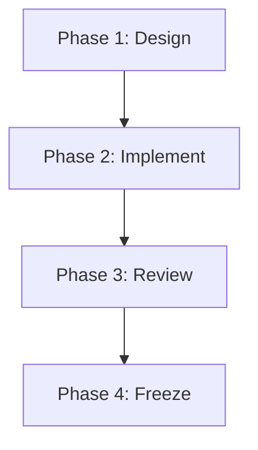

# CampusCopilot Design Rules

This document serves as the official design standard for all future development of **CampusCopilot**.

---

## 1. Design Philosophy

CampusCopilot is a premium AI platform. 

It should feel closer to Apple, Notion, Linear, ChatGPT, and Google Workspace than a traditional college ERP.

Every screen should answer one question:
> "How does this make campus life easier today?"

---

## 2. UI Principles

*   **Minimal**: Clear workspaces with no unnecessary visual elements.
*   **Clean**: Structured layouts with consistent margins and line-heights.
*   **Spacious**: Generous use of padding and gutters to let content breathe.
*   **Friendly**: Inviting, soft interactive elements and transitions.
*   **AI-First**: Integrating predictive actions and assistance contextually.
*   **Student-First**: Prioritizing student workflows and real-world deadlines.
*   **Professional**: Pixel-perfect, consistent align-grids and premium details.
*   **Modern**: Curated gradients, subtle depth, and contemporary typography.

*Avoid clutter. Maintain exactly one clear, primary call-to-action (CTA) per screen.*

---

## 3. Color System

| Palette Role | Color Name | Hex Code | Visual Reference |
| :--- | :--- | :--- | :--- |
| **Primary Accent** | Purple | `#6D5EF9` | Branding, main actions, focus states |
| **Secondary Accent** | Blue | `#4F8CFF` | Secondary details, indicators |
| **Background** | Soft White | `#F8FAFC` | Main canvas color (default Light Mode) |
| **Cards** | Pure White | `#FFFFFF` | Panels, content grids (subtle shadows) |

> [!NOTE]  
> **Dark Mode** is supported natively via CSS variables and `.dark` class toggles, but is **not** the primary design entry point. Default user experiences should always land in Light Mode.

---

## 4. Typography

*   **Headings**: **Outfit** (modern, geometric sans-serif for strong, clean presentation).
*   **Body**: **Inter** (highly readable sans-serif optimized for variable weights and dense text).
*   **Buttons & Navigation**: **Semi-bold** weight for clear, scan-ready actions.

*Always maintain excellent text contrast and line-height ratios (e.g., `1.5` for body copy).*

---

## 5. Layout Rules

*   **Whitespace**: Use generous margin blocks to isolate distinct sections.
*   **Maximum Content Width**: `1440px` (centered for wide desktop resolutions).
*   **Grid System**: Consistent spacing using an **8px base grid** (e.g., `8px`, `16px`, `24px`, `32px`, `48px`).
*   **Rounded Corners**: `20px` border-radius on cards, dialogs, and large modules.
*   **Card Styling**: Card overlays must feel lightweight. Avoid deep shadows; prefer border borders combined with fine, ambient blurs.

---

## 6. Buttons

*   **CTA Count**: Only one primary CTA button is permitted per screen context.
*   **Hover States**: Subtle scale-up/lift animations (`1.01` to `1.02` scaling) combined with active spring taps.
*   **Transition Duration**: `200ms`–`300ms` ease curves on property shifts.

---

## 7. Cards

*   **Shadows**: Soft, multi-layered shadows (`0 1px 3px rgba(0,0,0,0.05), 0 10px 15px -3px rgba(0,0,0,0.02)`).
*   **Corners**: Large border-radius (`20px`) matching layout scales.
*   **Padding**: Consistent internal margins (typically `24px` / `p-6`).
*   **Glassmorphism**: Avoid excessive glass overlays. Use backdrop filters (`backdrop-blur`) only where they measurably improve overlay contrast and text readability.

---

## 8. Animations

*   **Framework**: **Framer Motion** for React transitions.
*   **Aesthetics**: Smooth, spring-based easing velocities.
*   **Speed**: Fast responses (sub-`300ms` target durations).
*   **Intent**: Never distracting. Animations must communicate component state shifts (open/closed, loading, complete), not serve as pure visual decoration.

---

## 9. AI Components

Every AI-generated response or assistant card must support:
*   📋 **Copy**: Clipboard copier action.
*   🔍 **View Details**: Technical logs and settings toggle.
*   🔗 **Sources Used**: References, document links, or citations.
*   🤖 **Agents Used**: List of sub-agents coordinating the response.
*   📅 **Last Updated** *(Optional)*: Date and timestamps.

> [!IMPORTANT]  
> Do not display technical variables or latency statistics on initial render. Hide them under the expandable **"View Details"** accordion section.

---

## 10. Dashboard Principles

*   **Recency**: Only present information relevant to the current day.
*   **Purpose**: Every widget must have a clear, isolated objective. No generic visual clutter.
*   **Statistics**: Avoid unnecessary, complex statistical plots.
*   **Widget Priorities**:
    1.  *Today's Spark* (Immediate highlight summary)
    2.  *Campus Pulse* (Active campus news / trends)
    3.  *Schedule* (Classes and timelines)
    4.  *Assignments* (Deadlines and tasks due)
    5.  *Calendar* (Timeline logs)
    6.  *Quick Actions* (Common triggers)
    7.  *Notices* (Critical alerts)

---

## 11. Accessibility

*   **Keyboard Navigation**: Full focus-ring support and `tabIndex` loops on interactive panels.
*   **ARIA Labels**: Clear `aria-label` tags on icon buttons and navigation endpoints.
*   **Responsive**: Seamless layout shifting across Mobile, Tablet, and Desktop screen widths.
*   **Contrast**: Meet or exceed WCAG text contrast ratios (light/dark elements).
*   **Readability**: Minimum body font sizes of `14px` (`text-sm`) with clear spacing.

---

## 12. Branding

*   **Identity**: Use the official **CampusCopilot Logo** (Graduation Cap combined with clean font weights).
*   **Anti-Patterns**: Do **not** use generic robot, gear, or motherboard icons to represent AI.
*   **Consistency**: Maintain consistent branding colors and layout parameters across every screen.

---

## 13. Development Workflow

1.  **Design First**: Map UI mockups and component placements.
2.  **Implement Second**: Build code strictly complying with CSS and design tokens.
3.  **Review Third**: Inspect layouts against accessibility, contrast, and performance rules.
4.  **Freeze Fourth**: Mark components and screens as frozen code.

*Never redesign a frozen screen unless an active usability issue is discovered.*
